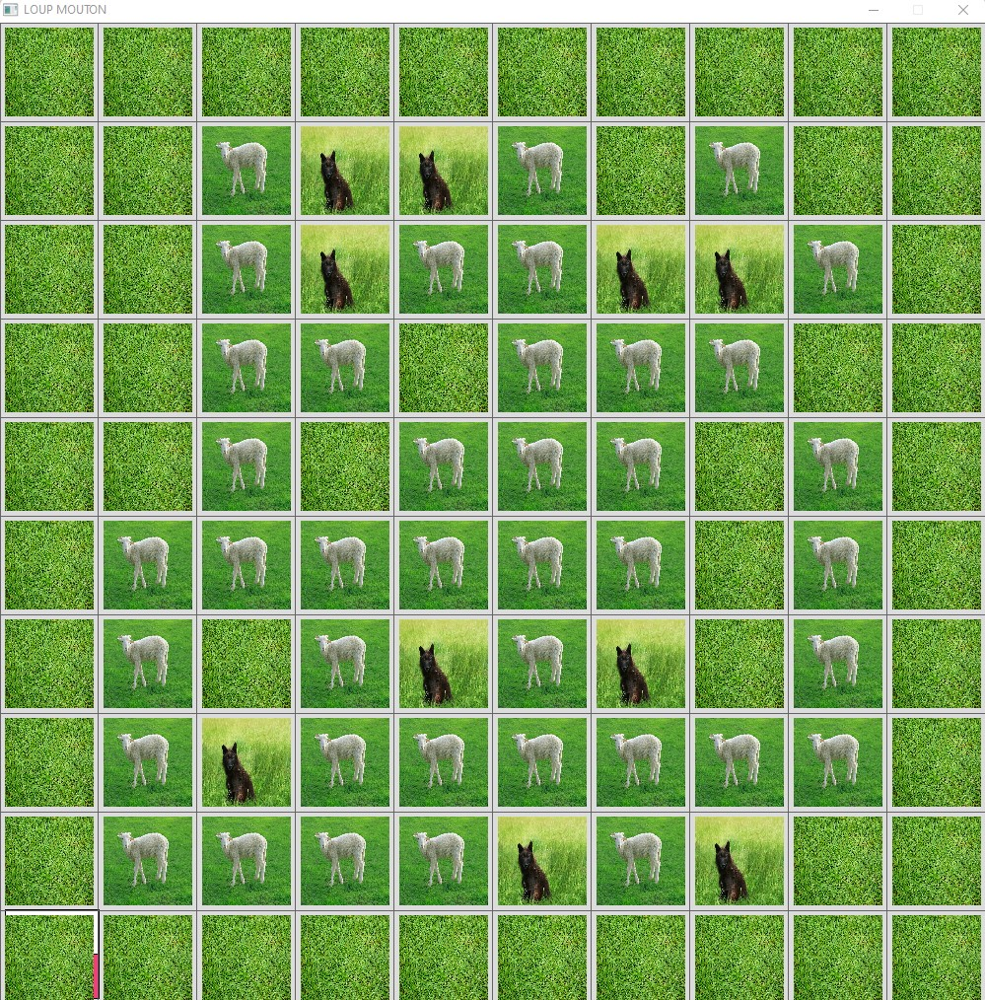
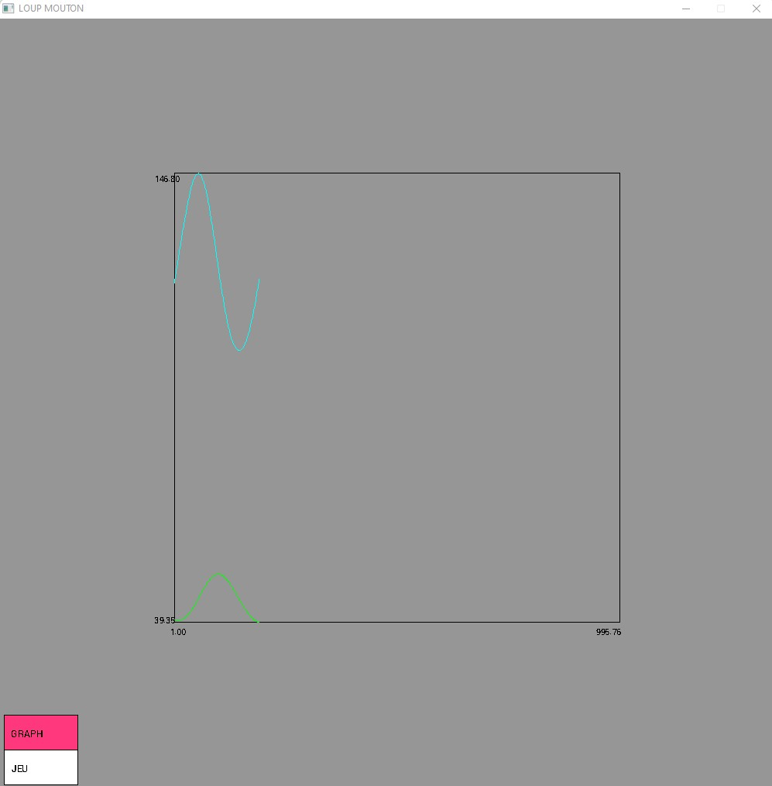
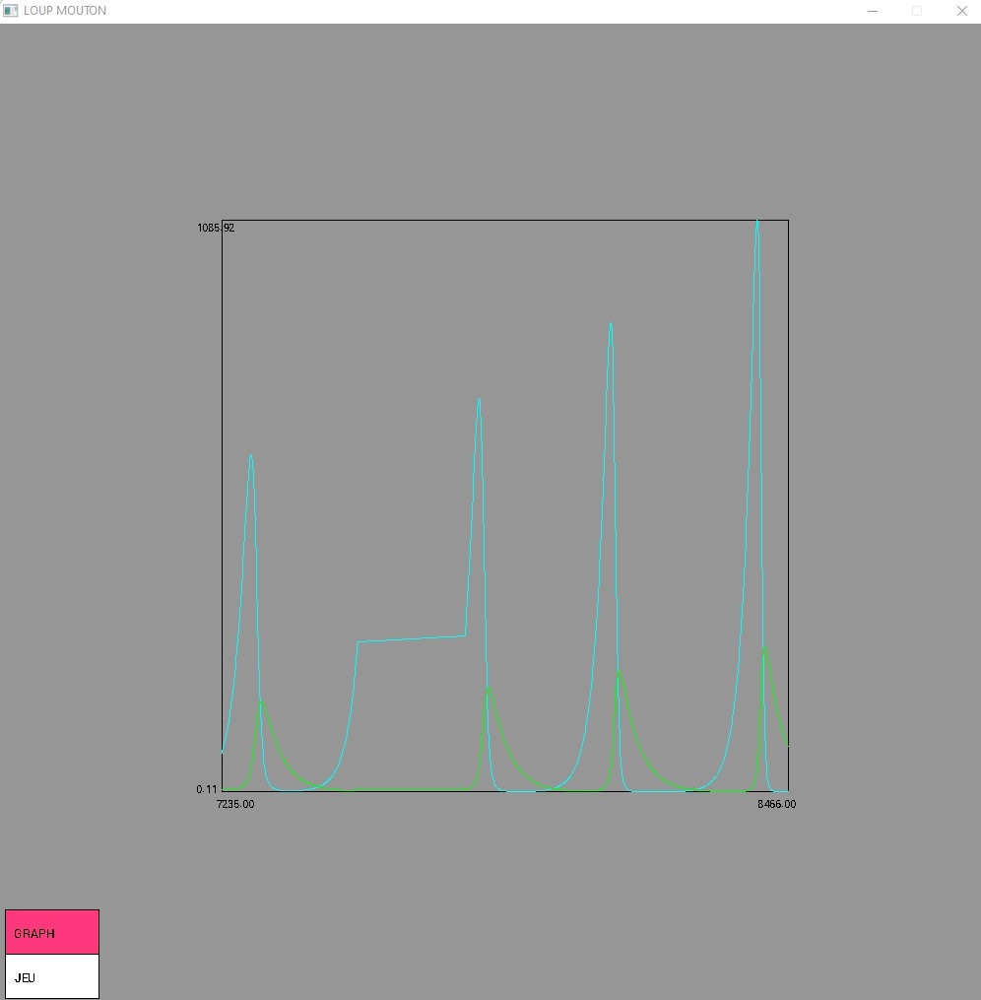

# Simulator Prey Predator Graph

I had to simulate the prey/predator system based on rules
of death/survival as they occur (approximately) in nature. The objective is
to follow the evolution of each population over time as in the analytical version
based on the Lotka-Volterra equations and to verify that we obtain a behavior
similar. For each individual we will state rules (more or less complex and realistic)
of birth, reproduction, survival and death (by predation, hunger, or even old age).

The graphic rendering:



The evolution of the corresponding graph:




To switch between the 2 there is the pink menu at the bottom left of the screen.

# Subject

```
1. A state of population equilibrium is observed when neither of the two populations in
presence does not evolve, that is to say when the corresponding derivatives are zero. write
this new system of equations and find its solutions.

2. By applying the coefficients alpha = 0.045, beta = 0.001, Yeta = 0.025 and Sigma = 0.0002 to a
initial population of 120 prey and 40 predators, write the equations allowing
calculate the number of prey and predators at time t+1 as a function of time t.

3. We will now describe the structures necessary for the implementation of the model
prey / predators in C/C++. Define an Ecosystem structure which in its version
initial will contain the following fields: nb_preys, nb_predators, as well as the 4
real coefficients of the Lotka-Volterra equations denoted alpha, beta, gamma and delta.

4. Write an evolution_ecosystem function that simulates the evolution of each of the
populations over time. The results obtained (number of prey and predators
at each moment) will initially be stored in a table.

5. After having defined the structures necessary for modeling the prey system /
predator and initialized the parameters with the previous values, modify the procedure
evolution_ecosystem by displaying at each time step the number of prey
and predators on a graph. To do this, you will use the Grapic functions:
 - plot_setSize (Plot &p, const int n)
which defines the number of values ​​retained (if n<0 an infinity, default case).
 - plot_add (Plot &p, float x, float y, int curve_n)
which adds a point (x,y=f(x)) to curve number curve_n.
 - plot_draw (const Plot &p, int xmin, int ymin, int xmax, int
ymax, bool clearOrNot)
which draws the curve in the rectangle (xmin,ymin,xmax,ymax); and erase it
content of the rectangle if clearOrNot is true.

6. Define an Individual structure which will contain the individual_type fields (prey,
predator or grass), lifespan and young lifespan.

7. The visual representation of the system will be done using a 2D grid in which
Individuals (prey or predator) will be present. Define the Ecosystem structure
which will contain a 2D grid of individuals (as well as the grid size parameters
dx and dy), the number of prey and predators and for each population an image
(prey, predator and grass).

8. Write the procedure evolution_ecosysteme which predicts the future of each individual
depending on its environment (neighborhood) with the following two rules.
 - If two prey are in adjacent squares, they reproduce and give
therefore birth of a new prey type individual placed in a free box.
 - If a predator has prey in its vicinity, it eats it, if it has another
predator in its neighborhood it reproduces only if there is space left
in the neighborhood.

9. Define the constants PREY_LIFE_DURATION, PREDATOR_LIFE_DURATION,
MAX_JEUNE_PREY, and MAX_JEUNE_PREDATOR.

10. Define the Individual and Ecosystem structures. Choose an image for each
type of individual (prey, predator and grass) and save them in the data folder. These
images must be stored in the Ecosystem structure.

11. Write the init_ecosysteme procedure which will initialize the system with values ​​by
default (grid size 10 by 10, with 40 prey and 10 predators). You will complete here
the entire grid with grass then randomly position your prey and predators.

12. Write the draw_ecosysteme procedure which displays the contents of the grid with the
corresponding images in a Grapic window.

13. Implement the basic version of the evolution_ecosysteme procedure and proceed to
each iteration the number of prey and predators to a Grapic Plot curve.

14. Display the evolution curve of the two populations and compare it to the curve
theoretical obtained thanks to the Lotka-Volterra equations

```

# GrAPiC 

## Starting

Linux, Windows and Mac instruction :

http://licence-info.univ-lyon1.fr/grapic

## Introduction

GrAPiC is a small, easy-to-use framework to add graphical functionalities to your C/C++ code. 
Its main goal is to provide easy graphical functions to be used in introduction courses of algorithm and programming in C/C++. 
It is based on SDL2 but to use it you need to know only few very simples functions. 
The Grapic archive comes with the needed SDL part, you do not have to install SDL. Just unzip and enjoy ! 

## Starting

Compiling from the github (which is not the standard way).

* On Linux you need to install:
- g++
- doxygen
- zip
- lib-sdl2-dev lib-sdl2 sd2_image... sdl2_ttf...

1. sudo apt install g++ premake4 zip doxygen libsdl2-dev libsdl2-mixer-dev libsdl2-image-dev
2. make premake
3. make
(4. script/make_linux_test.sh): to test the archive doc/download/grapic-linux.tgz
(5. script/make_web.sh): to create the zip files in doc/download or to sync everything to the webpage (need passwd).


* On windows
0. Install CB 20
1. run premake-cb20.bat to generate the projects files    or     run premake-lifami.bat to generate lifami projects 
2. open build/windows-cb20/grapic.workspace

## Best way to make a projet in windows

(windows): 
 - Open build/windows-cb20/grapic.workspace in CodeBlocks
 - In the left part (Management) of the logiciel, double clic in the projet of yours choice (it's those in /apps)
 - Finally clic in the green arrow in the top of the screen


## Put your new project in GraPic

Add your directory with your cpp files in "apps" and add the path in "premake4".

